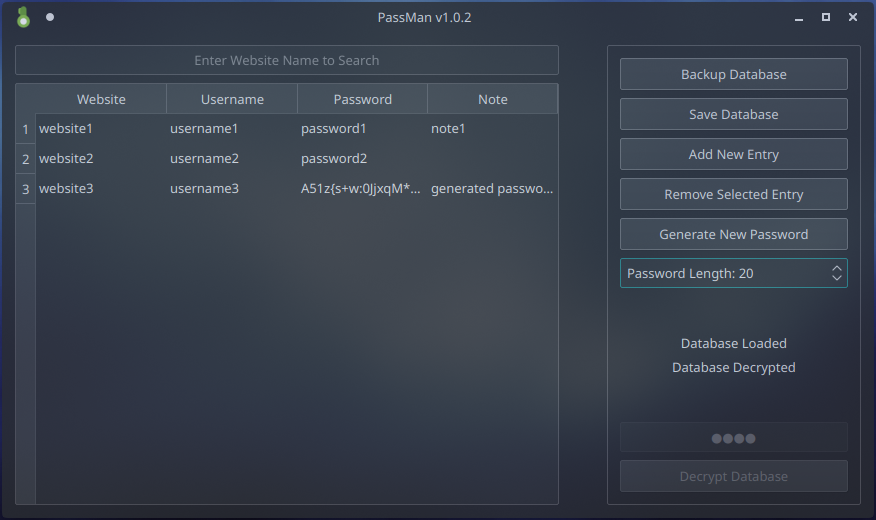

# Passman
A Simple Password Manager with AES-256 Encryption 
Files **qaesencryption.cpp** and **qaesencryption.h** are from [This Repo](https://github.com/bricke/Qt-AES)

Version 1.0.3 

## Installation
Check **[Releases](https://github.com/Aslan2142/passman/releases)** section

## How To Use
Simply Run Program and it'll launch QT GUI 

It can also be used within CLI 
Type **passman --help** for list of commands 
Running **passman** without arguments will launch QT GUI

## How To Compile and Make Package

### Debian Linux:
Run **makedebpkg.sh** script with parameter {amd64/arm64} 
This will make .deb package 
Install with **dpkg -i passman_debian_{amd64/arm64}.deb** 

Compilation Example: **makedebpkg.sh amd64** 
Installation Example: **sudo dpkg -i passman_debian_amd64.deb** 

### Arch Linux:
Run **makearchpkg.sh** script with parameter {amd64/arm64} 
This will make .tar.xz package 
Install with **pacman -U passman-{version}-{release}-{x86_64/aarch64}.pkg.tar.xz** 

Compilation Example: **makearchpkg.sh amd64** 
Installation Example: **sudo pacman -U passman-1.0.0-1-x86_64.pkg.tar.xz** 

### Windows:
Use QT Creator

### Mac OS:
Use QT Creator
